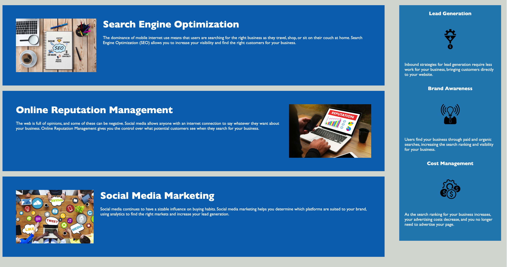

# Horiseon Code Refactor

## Description

---

Code refactor is a project to refactor starter code for Horisean marking agency. Their code was refactored to increase web accessibility so that people with disabilities can access their webpage and also so that it ranks higher in search engines.

- fixed broken link
- added semantic HTML elements
- refactored redundant CSS code
- added alt attributes to images and icons

Example of refactored code with added semmantic elements and comments:

```
<!--added more descriptive title-->
    <title>Horiseon Marketing Agency</title>
  </head>

  <body>
    <!--modified Div to be header tag because header is a semantic element-->
    <header>
      <h1>Hori<span class="seo">seo</span>n</h1>
      <!--modified Div to be nav tag because the below link needs to be on a navigation bar-->
      <nav>
        <ul>
          <li>
            <a href="#search-engine-optimization">Search Engine Optimization</a>
          </li>

```

## Usage

---

The webpage has a navigation bar on the top right side which the user can select one of the options they would like to learn more about.


Selecting one of the three options will direct the user to a section that will provide some more information about the option they slected.



There is also an aside section of the webpage that provides the user with additional info on Horiseon's services.

## Credits

---

[Andrey Sitnik's GitHub README.md example used as reference for this README.md](https://github.com/ai/size-limit#readme)

[UCB bootcamp Gitlab README.md used as reference for this README.md](https://ucb.bootcampcontent.com/UCB-Coding-Bootcamp/UCB-VIRT-FSF-FT-09-2022-U-LOLC/-/tree/main/course-content/01-html-git-css/challenge/Good-README-Guide)

[Adam Pritchard's markdown cheatsheet used as reference](https://github.com/adam-p/markdown-here/wiki/Markdown-Cheatsheet#lines)

[W3 schools was used extensively for both HTML and CSS reference guides](https://www.w3schools.com/)

## License

---

This webpage is licensed under the MIT license.
[](https://opensource.org/licenses/MIT)
